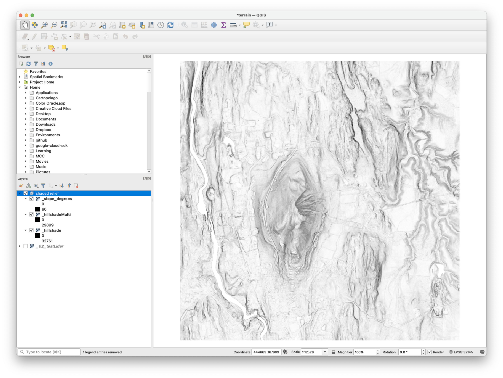

## Purpose  

The shadedRelief tool produces three layers that can be combined to make shaded relief maps.  

## 1. Replicate script  

Atom>File>New File 'shadedRelief.py' into project folder. Copy script from [methods repo](https://github.com/GEOG0310/methods/tree/master/wbHome){target=_blank}. Paste script into 'shadedRelief.py'. Save file.    

## 2. Organize workspace     

Make a 'data' directory within your 'wbt_pySpace' directory (if you do not already have one).

Copy the path to 'data' folder so you can set it as the working directory.  

```python
wbt.work_dir = "/Users/jhowarth/projects/GEOG0310/methods/wbHome/data"
```

Also check the name for your DEM (it may not be the same as below).

```python
dem = "../testDEM/_02_testLidar.tif"
```  

## 3. Run  script  

In Atom, packages>script>run script. (Short cut: Command-I on Mac or Control-I on Windows).  

## 4. Inspect result  

In Q, create a new **group** and name it **shaded relief**. Then add the three layers to the group.  



## 5. Style your shaded relief  

In Q, use layer order, transparency, and Symbology>blended mode to create a shaded relief map that helps you interpret the terrain.  
