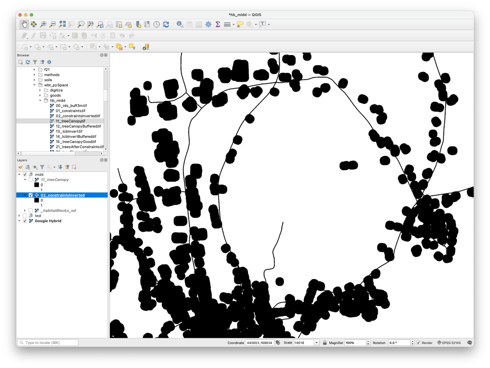
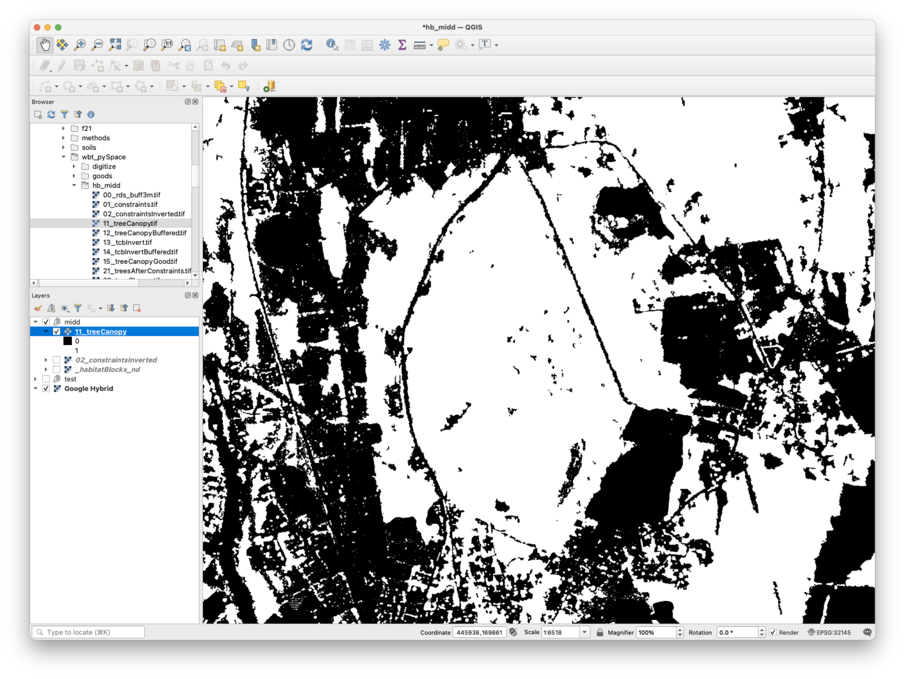
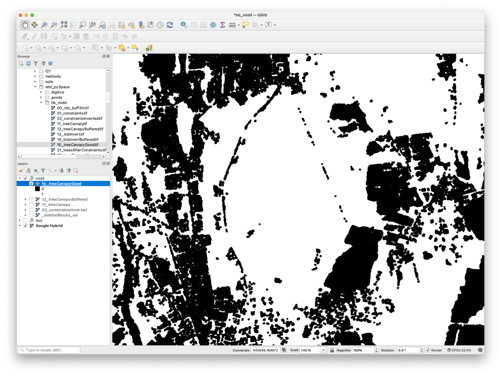
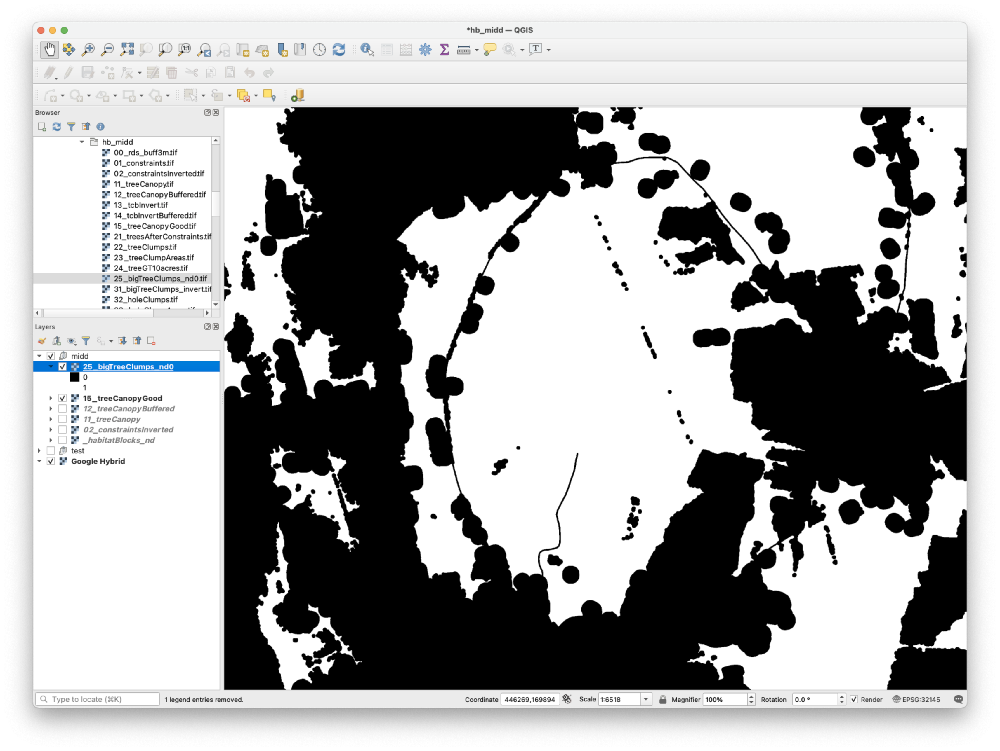
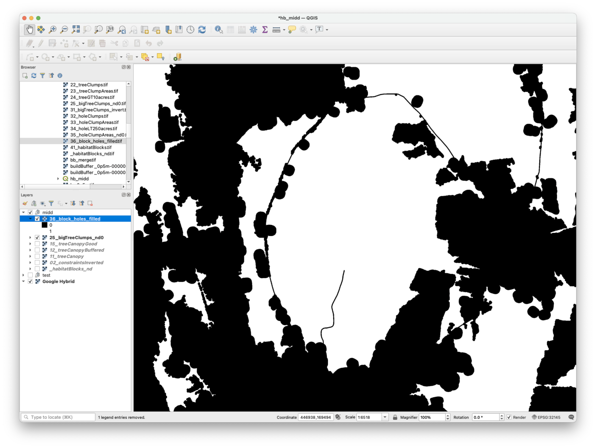

## Purpose  

To identify habitat blocks as directed by [Act 171](https://anr.vermont.gov/Planning/Forest_Blocks_And_Habitat_Connectors){target=_blank}.  

## Data prep  

- [Land cover](../datasets/landcover.md): to identify tree canopy and impervious or bare land    
- [Roads](../datasets/roads.md): to identify highways or interstates or Class 3 roads  
- [Buildings](../datasets/buildings.md): to identify areas within 100ft of a building (to remove landscaped tree canopy near buildings)  
- Export each dataset for Middlebury Study Area (_need to include a description for this_)

## Data process     

### 1. Create fragmentation layer  

This step modeled features on the landscape that can fragment forest habitat.

We considered state or federal highways and Class 3 town roads as fragmenting roads. We did not include Class 4 town roads, trails, forest highways, ferry routes, or private roads as features that fragment habitat, nor did we include railroad lines.  

We added a 3 meter buffer to roads in order to approximate width because the source dataset was vector.  

We considered land within 100ft of a building (including the building footprint) to be a fragmenting feature. This aimed to identify tree canopy that may be part of the landscaping footprint of a building.   

  

### 2. Model tree canopy    

This step modeled patches of tree canopy. We first identified tree canopy from the land cover dataset.  

Many forests in Middlebury include long cuts for powerlines. For example, the picture below shows two powerline cuts through Chipman Hill. While these cuts create edge effects on interior forest habitat, we do not consider these to be fragmenting features of habitat blocks. (Rather, we consider these cuts to influence the quality of habitat within blocks, which we address in a separate model).    

  

To lump these cuts with tree canopy, we buffered the tree canopy layer by 7.5 meters, inverted the layer, and then buffered the layer again by 7.5 meters. This lumps narrow cuts in the tree canopy (where a tree canopy edge is within 15 meters or another tree canopy edge) without extending the canopy edge in places that are greater than 15 meters from another tree canopy edge. While this method leaves small holes along power lines cuts, these will be filled in step 4 below.  

  

### 3. Identify tree clumps   

This step identifies patches of tree canopy that are at least 10 acres.  

We erased fragmenting features (result of step 1) from the tree canopy (result of step 2), identified clumps, calculated area, and then removed any clump less than 10 acres in area.  

Our last step was to convert noData to zero, because the clump method had created noData as a background value.   

  

### 4. Fill holes   

This step aimed to fill small holes within the patches of tree canopy identified in the last step. We did this by clumping contiguous regions of non-tree canopy and then adding any regions that were less than 250 acres to the tree canopy layer.     

### 5. Identify habitat blocks  

The last step identified discrete habitat blocks by clumping the result of the last step.  

## Python script  

We implemented this model with the [WhiteboxTools Open Core](https://www.whiteboxgeo.com/geospatial-software/){target=_blank}. The **habitatBlock.py** script can be found [here](https://github.com/conservation-plan/methods/blob/master/wbt_pySpace/habitatBlocks.py){target=_blank}.   
