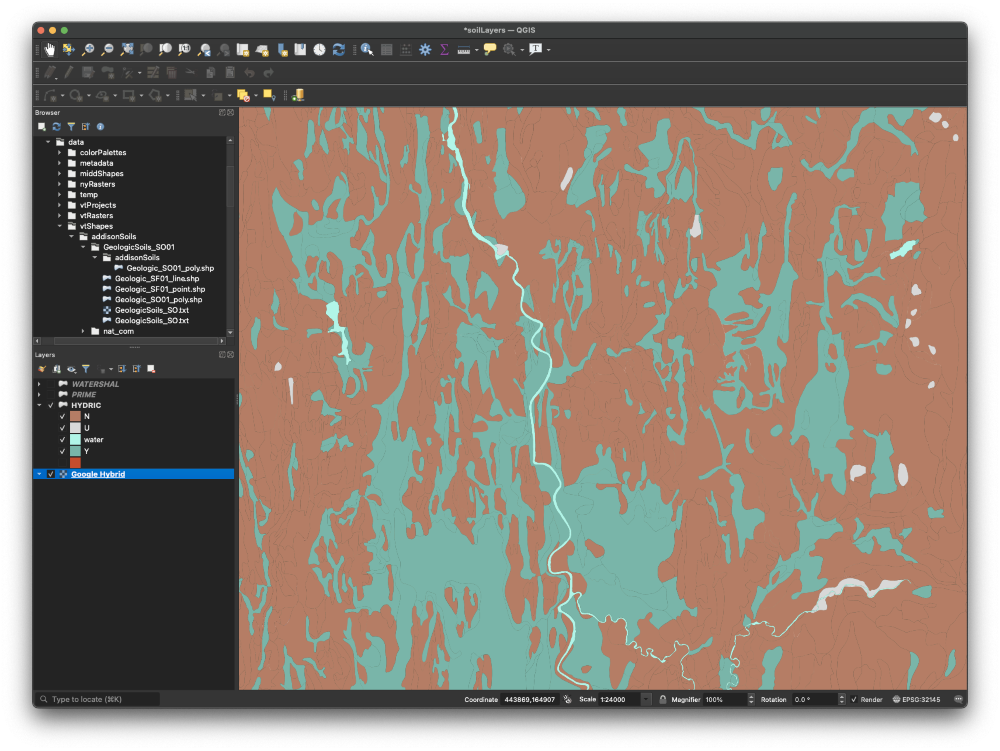

[Hydric soils](https://www.nrcs.usda.gov/wps/portal/nrcs/detail/soils/use/hydric/?cid=nrcs142p2_053961){target=_blank} are form under wet conditions during the growing season so that the upper part develops anaerobic conditions. They help identify potential wetlands, including in areas currently used for agriculture.

## Schema  

| Code | Description |
| :---: | :--- |
| Y | At least one component of the major components in the map unit is a hydric soil. |
| N | None of the major components in the map unit is a hydric soil.  |
| U | All of the major components are miscellaneous land types and the map unit is unranked |
| W | Water |

## Display

This is a largely a binary classification, so I used a complementary palette.  

   

## Practice  

Try to symbolize the layer like the picture below.  

