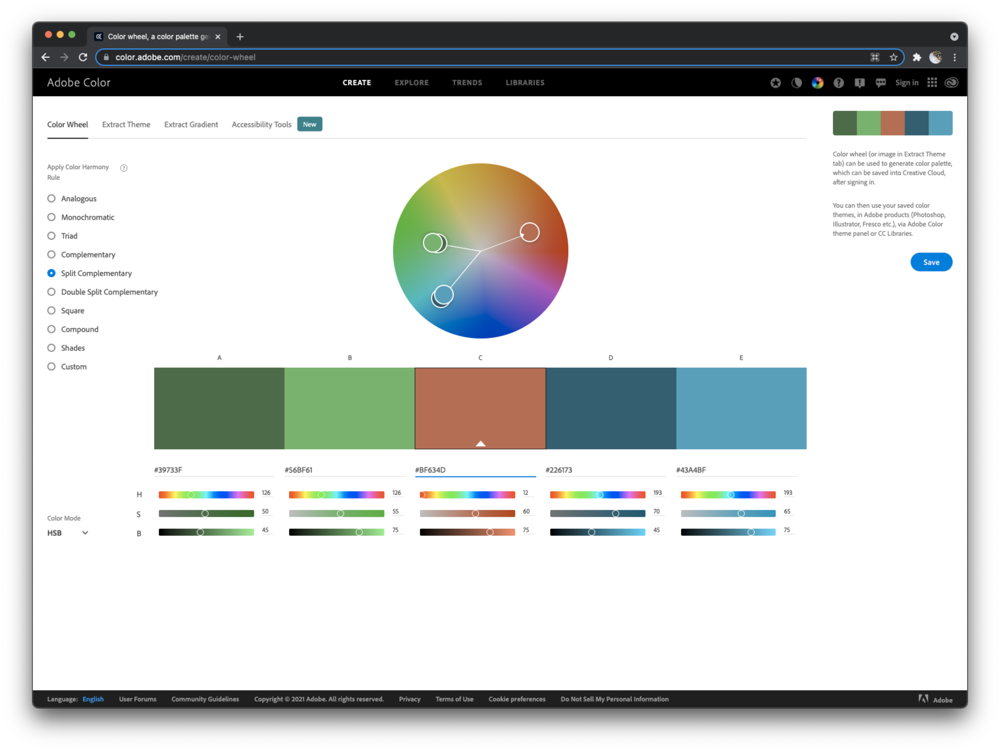
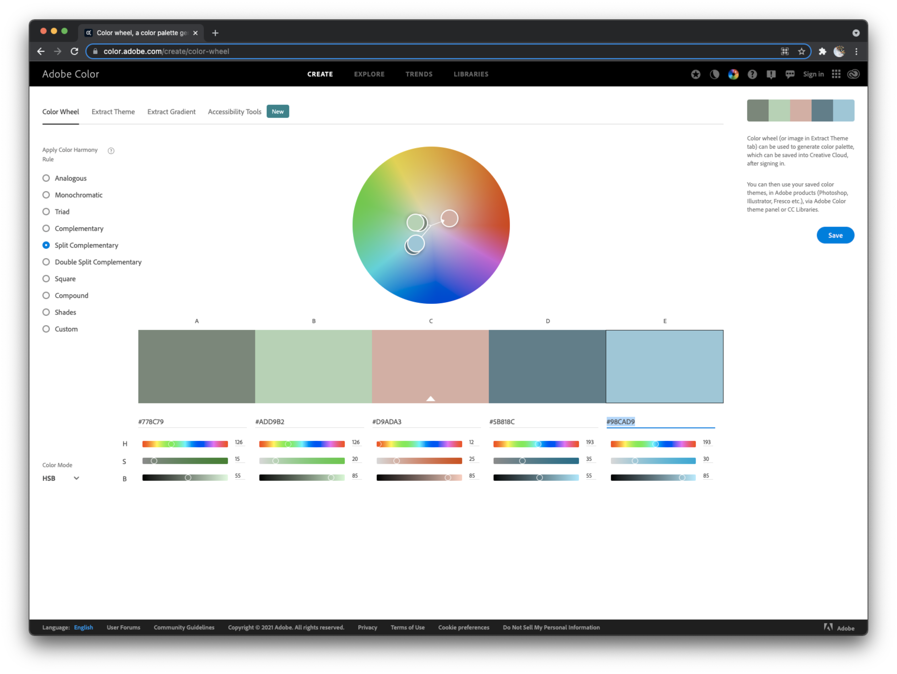
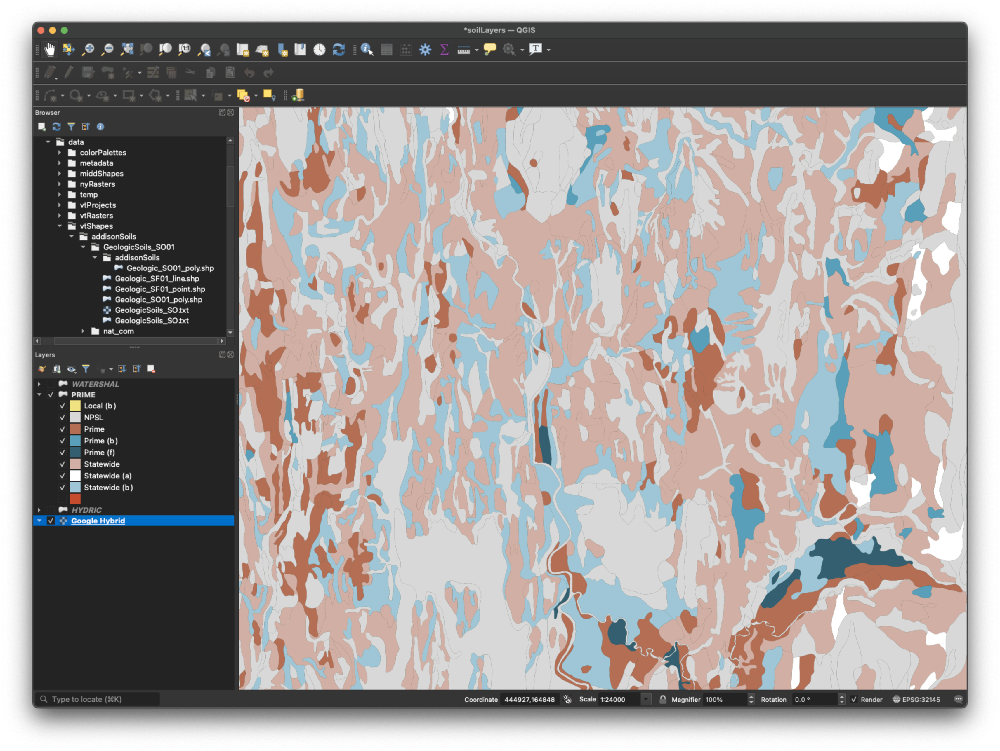

## Prime agriculture  

Criterion 9b of Act 250 concerns Primary Agricultural Soils as defined by the [Farmland Classification system for Vermont](https://drive.google.com/file/d/1TP2_-SwG4UpUWVKo6tFRm49J1RJTLzhf/view?usp=sharing){target=_blank}.  

| Category | Description | Too  steep | Too  wet | Too  rocky | Freq  Flooded
| :--- | :--- | :---: | :---: | :---: | :---: |
| Prime | Prime farmland: best combination of physical and chemical characteristics for producing food, feed, fiber, forage, and oilseed crops and are also available for these uses. The present land may be cropland, pasture, forestland, or other land uses, but not urban and built-up or water. | | Prime (b) | | Prime (f) |   
| Statewide| Additional Farmland of Statewide Importance: important but with limitations due to slope, erosion, excessive wetness, slop permeability, flood hazard, shallow depth, or low available water capacity. | Statewide (a) | Statewide (b)|  | |
| Local| Additional Farmland of Local Importance: with limitations that can be overcome. | | Local (b) | | |
| NPSL | Not prime, statewide, or local. | | | | |

## Symbology
Because the local soil class does not occur in Middlebury, I used the same hue scheme for Prime and Statewide soils based on a split complementary method with [Adobe Color Wheel](https://color.adobe.com/create/color-wheel){target=_blank}. I then emphasized Prime soils by lowering saturation and value for Statewide soils. To make the palette universal, I used only the red and blue portion of the palette, and did not use the green colors that would have little contrast with the red color for readers with deuteranopia.     

_PRIME PALETTE_

_STATEWIDE PALETTE_   

## Practice  
Try to symbolize a layer like the picture below.  

    
